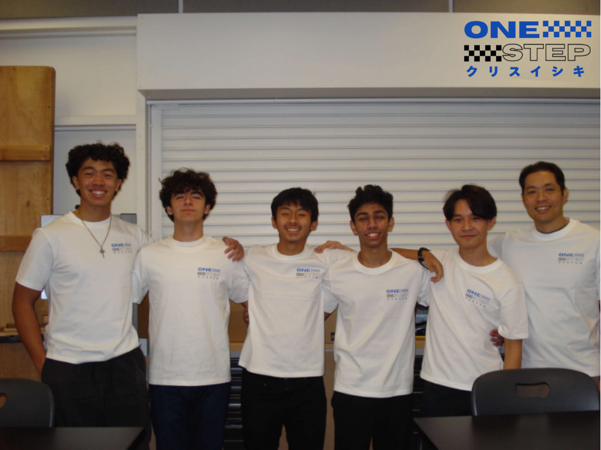

# One-Step:
Team One-Step is a team dedicated to creating an IMU-powered micro-controlled knee-extension device for Cris Ishiki, an above-the-knee amputee and victim of diabetic infection.

## Repositories:
- [one-step-angle](https://www.github.com/whs-one-step/one-step-angle): Contains the appropriate programming to calculate the knee-flexion angle using two IMUs.
- [one-step-writer](https://www.github.com/whs-one-step/one-step-writer): Contains optimizations programmed in C that the one-step-joint repository uses to communicate encoded pulse width modulation in binary.
- [one-step-optimizations](https://www.github.com/whs-one-step/one-step-optimizations): Contains optimizations programmed in C that the one-step-joint repository uses to reduce latency and increase efficiency when calculating the knee-flexion angle.
- [one-step-joint](https://www.github.com/whs-one-step/one-step-joint): The main repository of the organization, containing the appropriate programming together binding the one-step-learner, one-step-writer, and one-step-calculator to power a motor controller.
- [one-step-arduino](https://www.github.com/whs-one-step/one-step-arduino): Contains the programming to read the GPIO pins from the Raspberry Pi, decoding the encoded pulse width modulation into a decimal and appropriately powering a motor.
- [one-step-collections](https://www.github.com/whs-one-step/one-step-collections): Contains a series of CSV files that will later be processed and train a potential one-step-agent that is catered to Mr. Ishiki, predicting his gait state.
- [one-step-learner](https://www.github.com/whs-one-step/one-step-learner): A training environment programmed in Python dedicated to producing one-step-learner agents that can predict gait-states.

## Initialization:
Each Python repository is bootstrapped with Linux scripts to quickly install dependencies and setup Python Virtual Environments dedicated to running the project.

## Framework:
No frameworks were used excluding the use of Arduino, as no repositories except for the Arduino were forced to be structured in a specific way.

## Language:
Python was mainly used for the project, with it allowing for extreme developer productivity when creating prototypes.
* Additionally, C was used to include optimizations to reduce latency and increase efficiency and performance.

Shared libraries were produced using the **GCC** compiler. Lastly, bash was used to create Linux scripts capable of installing dependencies and packages for streamlining the process of setting up projects.

## Document:
The entire document containing the development process and mental processes of the teammates is [here](https://docs.google.com/document/d/19fnh3jgbUX5eb0fLQix96BV6Mby11RzgMaiaW786JXY/edit?usp=sharing).

## Team:

- Ben Lou (Coordinator): Circuitry and Stabilization, Design
- Christopher Gholmieh: Artificial Intelligence, Calculations, Arduino, and Optimizations.
- Jacob Andal: Stabilization & 3D-Printing
- Christian Ishiki: Stabilization & Materials
- Saahir Kadri: Calculations

## Packages & Libraries:
- joblib - serializing and deserializing models to save one-step-learner models
- loguru - logging information, warnings, and errors for debugging purposes
- matplotlib - creating three-dimensional and two-dimensional graphs regarding telemetry
- numpy - performing optimized math functions such as matrix multiplication (used to calculate flexion)
- pandas - data processing for CSV files, used to train one-step-learners
- phidget22 - the python bindings used to communicate with PhidgetSpatial 3/3/3 IMUs and collect information such as acceleration and rotation
- scikit-learn - used to create decision-tree processing artificial intelligence models (RainForestClassifier) to predict whether a person was walking forwards, backwards, or standing still
- scipy - was used to implement filters such as the low pass filter and used for quaternion processing
- wiringpi - used to create C-optimized bindings to interact with GPIO pins
- gcc - compiled C code into shareable libraries used by python
- RPi.GPIO - used to interact with GPIO in python, but was later removed in favor of C bindings

## Arduino:
Arduino was used to power a motor controller, providing functionality of potentially extending the knee-extension device.